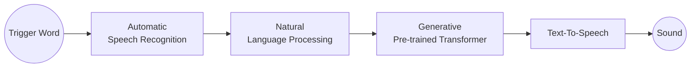

<!--
 * @Author: Frank Chu
 * @Date: 2023-02-13 18:05:53
 * @LastEditors: Frank Chu
 * @LastEditTime: 2023-02-18 20:48:53
 * @FilePath: /SmartSpeaker/README.md
 * @Description: 
 * 
 * Copyright (c) 2023 by ${git_name}, All Rights Reserved. 
-->
# Smart Speaker based on GPT by OpenAI



- [Trigger - picovoice.ai](https://picovoice.ai/docs/quick-start/porcupine-python/)
- [Recording - PyAudio](https://pypi.org/project/PyAudio/)
- [ASR - Microsoft Azure](https://learn.microsoft.com/en-us/azure/cognitive-services/speech-service/get-started-speech-to-text?tabs=macos%2Cterminal&pivots=programming-language-python)

## Table Of Content

- [Smart Speaker based on GPT by OpenAI](#smart-speaker-based-on-gpt-by-openai)
  - [Table Of Content](#table-of-content)
  - [Characteristics](#characteristics)
    - [Example Questions](#example-questions)
  - [Steps](#steps)
    - [Step 1. Install all dependencies `client - npm install`](#step-1-install-all-dependencies-client---npm-install)
    - [Step 2. Train Wake word(Optional)](#step-2-train-wake-wordoptional)
    - [Step 3. change .env.example to .env and filling .env files](#step-3-change-envexample-to-env-and-filling-env-files)
    - [Step 4. Change TEST\_MODE to True or IS\_RASPBERRYPI in server/utils/config.py](#step-4-change-test_mode-to-true-or-is_raspberrypi-in-serverutilsconfigpy)
    - [Step 4. run `server - app.py` and `client - npm start`](#step-4-run-server---apppy-and-client---npm-start)
  - [Installation](#installation)
    - [PyAudio](#pyaudio)
      - [Installation error on macOS](#installation-error-on-macos)
    - [picovoice.ai](#picovoiceai)
    - [Azure Speech Service](#azure-speech-service)
    - [dotenv](#dotenv)
  - [Reference](#reference)
    - [Services](#services)
    - [Articles](#articles)

## Characteristics

- [prompt completion](https://platform.openai.com/docs/quickstart/introduction)
- [continuous dialog](https://platform.openai.com/docs/quickstart/introduction)
- precise ASR(speech to text)

### Example Questions

- Prompt: Write a tagline for an ice cream shop.
  - Completion: We serve up smiles with every scoop!
- Suggest one name for a horse.
  - Lightning
- Suggest one name for a black horse.
  - Midnight
- Suggest three names for a horse that is a superhero.
  1. Super Stallion
  2. Captain Colt
  3. Mighty Mustang

```ChatGPT
$ Suggest three names for an animal that is a superhero.
Animal: Cat
Names: Captain Sharpclaw, Agent Fluffball, The Incredible Feline
Animal: Dog
Names: Ruff the Protector, Wonder Canine, Sir Barks-a-Lot
Animal: Horse

Names: Super Stallion, Mighty Mare, The Magnificent Equine
```

## Steps

### Step 1. [Install all dependencies `client - npm install`](#installation)

### Step 2. [Train Wake word(Optional)](https://console.picovoice.ai/ppn)

### Step 3. [change .env.example to .env and filling .env files](#dotenv)

### Step 4. Change TEST_MODE to True or IS_RASPBERRYPI in `server/utils/config.py`

### Step 4. run `server - app.py` and `client - npm start`

## Installation

run `install.sh` or follow the steps

### PyAudio

#### Installation error on macOS

```bash
# src/pyaudio/device_api.c:9:10: fatal error: 'portaudio.h' file not found
brew install portaudio
pip3 install pyAudio

# Linux
sudo apt install python3-pyaudio

# https://stackoverflow.com/questions/58974116/how-to-install-libasound2-dev-32-bit-without-using-apt-get
sudo apt-get install libportaudio2
```

- [PyAudio error at the time of intallation](https://stackoverflow.com/questions/71072094/pyaudio-error-at-the-time-of-intallation-subprocess-exited-with-error)
- [pypi.org/project/PyAudio](https://pypi.org/project/PyAudio/)

### picovoice.ai

```bash
pip3 install pvporcupine
pip3 install pvcobra
```

### Azure Speech Service

```bash
sudo apt-get update
sudo apt-get install build-essential libssl-dev libasound2 wget
pip install azure-cognitiveservices-speech
```

- [Install the Speech SDK](https://learn.microsoft.com/en-us/azure/cognitive-services/speech-service/quickstarts/setup-platform?pivots=programming-language-python&tabs=linux%2Cubuntu%2Cdotnet%2Cjre%2Cmaven%2Cnodejs%2Cmac%2Cpypi)

### dotenv

```bash
cd ./code && mv .env.example .env
pip3 install python-dotenv
```

```.env
PICOVOICE_AI_KEY=${YOUR-PICOVOICE-AI-KEY}
SPEECH_KEY=${MICROSOFT-AZURE-SPEECH-KEY}
SPEECH_REGION=${MICROSOFT-AZURE-SPEECH-REGION}
```

- [How to hide you API key with Python](https://bornforthis.cn/posts/19.html)
- [picovoice-key](https://picovoice.ai/docs/quick-start/porcupine-python/)
- [ms-azure-key](https://learn.microsoft.com/en-us/azure/cognitive-services/cognitive-services-apis-create-account?tabs=multiservice%2Canomaly-detector%2Clanguage-service%2Ccomputer-vision%2Cmacos#clean-up-resources)
- [openai](https://platform.openai.com/docs/quickstart)

## Reference

### Services

- [Real-time Speech-to-text](https://speech.microsoft.com/portal/speechtotexttool)

### Articles

- [Building a Raspberry Pi AI Assistant using Azure and IBM Cloud](https://fadyanwar.com/index.php/2020/06/27/building-a-raspberry-pi-ai-assistant-using-azure-and-ibm-cloud/)
- [Live Captioning with Azure Cognitive Services!](https://www.hackster.io/jenfoxbot/live-captioning-with-azure-cognitive-services-02c3f7)
- [Voice Assistant with Python](https://blog.csdn.net/m0_57307642/article/details/120849915)
- [GPT-3: text-davinci-003](https://platform.openai.com/docs/models/overview)
- [GPTHunt](https://www.bilibili.com/video/BV11M411F7Ww/?share_source=copy_web&vd_source=bf4952280cde801b178268abc99a7047)
- [GPTSpeaker](https://mp.weixin.qq.com/s/NUGygw8JgkdemVicO6fiPw)
